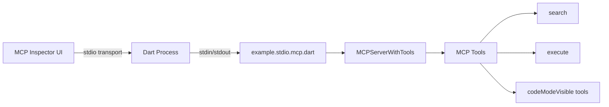

# Testing with MCP Inspector

This guide shows you how to test the easy_mcp code mode feature using the official [MCP Inspector](https://modelcontextprotocol.io/docs/tools/inspector) ([GitHub](https://github.com/modelcontextprotocol/inspector)).

**MCP Inspector** is an interactive developer tool for testing and debugging MCP servers. It provides a browser-based UI that lets you connect to a server, explore available tools and resources, execute tool calls, inspect request/response payloads, and monitor server notifications — all without writing any client code. It is the recommended way to validate that your MCP server behaves correctly before integrating it with production clients like Claude Desktop or Cursor.

## Prerequisites

- **Dart SDK** (3.11+)
- **Node.js** (for running MCP Inspector)
- **Node.js** (also required for code mode sandbox execution)

## Quick Start

### Step 1: Generate the Server

The MCP stdio server is **auto-generated** by `build_runner`. You must run this after any annotation change:

```bash
cd example
dart run build_runner build --delete-conflicting-outputs
```

This produces `bin/example.stdio.mcp.dart` from the annotated source file `bin/example.stdio.dart`.

> **Important**: Never edit `bin/example.stdio.mcp.dart` directly — it is a generated file. Change annotations in `bin/example.stdio.dart` or the library source files under `lib/src/`, then re-run `build_runner`.

### Step 2: Launch MCP Inspector

#### Option A: Launch Script (Recommended)

```bash
cd example
./launch_inspector.sh
```

This will:
1. Clean up any existing test data
2. Launch MCP Inspector in your browser
3. Configure it to connect to the generated stdio server (`bin/example.stdio.mcp.dart`)

#### Option B: Manual Launch

```bash
cd example
npx -y @modelcontextprotocol/inspector dart run bin/example.stdio.mcp.dart
```

## Architecture



## Why stdio for Testing

| Feature | stdio (MCP Inspector) | HTTP |
|---------|----------------------|------|
| Communication | stdin/stdout pipes | HTTP POST requests |
| Transport Layer | StreamChannel | Shelf web server |
| Notification Handling | Works correctly | Blocks response queue |
| MCP Inspector Support | Official support | Limited |
| Best For | Testing, debugging | Production deployment |
| Bidirectional | Native | Requires workarounds |

## Using MCP Inspector

### 1. Connect to the Server

When MCP Inspector opens in your browser (typically at `http://localhost:5173`):

1. Go to the **Connection** tab
2. Select **stdio** as the transport type
3. Configure:
   - **Command**: `dart`
   - **Arguments**: `run bin/example.stdio.mcp.dart`
4. Click **Connect**

The server will start and you should see initialization information.

### 2. Explore Available Tools

Navigate to the **Tools** tab. Because the example server is annotated with `@Mcp(codeMode: true)`, the standard `tools/list` response is replaced by just two orchestration tools:

- **`search`** — Discover available tools by name or description without loading every tool schema into context. Supports `brief`, `detailed`, and `full` detail levels. Uses hybrid matching: strict AND first, then ranked OR fallback.
- **`execute`** — Run JavaScript in a sandboxed Node.js subprocess that can invoke any code-mode-enabled tool via `call_tool(name, params)` or the generated `external_*` convenience wrappers.

All other tools (`createUser`, `listUsers`, `getUser`, `createTodo`, etc.) are **hidden from `tools/list` by design** when code mode is enabled. They are still fully callable from inside the `execute` sandbox — use `search` to find them, then invoke them with `external_<toolName>(...)` or `call_tool("<toolName>", params)`.

#### Opting a tool back into `tools/list`

If a specific tool needs to remain in the standard tool list (for example, a frequently used read-only query), annotate it with `codeModeVisible: true`:

```dart
@Tool(description: 'List all users', codeModeVisible: true)
static Future<List<User>> listUsers() async { ... }
```

That tool will then appear in `tools/list` alongside `search` and `execute`. Re-run `build_runner` after changing annotations.

#### Code mode availability vs. visibility

The `@Tool` annotation supports two independent flags:

| Flag | Default | Effect when `@Mcp(codeMode: true)` |
|------|---------|-----------------------------------|
| `codeMode` | `true` | Tool is indexed by `search` and callable from the `execute` sandbox |
| `codeModeVisible` | `false` | Tool is listed in the standard `tools/list` response |

In the bundled example, `deleteUser` has `@Tool(codeMode: false)` and does not set `codeModeVisible`, so it is completely absent from the generated server — not in `tools/list` and not callable from the sandbox. This protects destructive operations from accidental invocation.

### 3. Testing Tools Through `search` and `execute`

Because standard tools are hidden, you test them indirectly via the two orchestration tools.

**Example: Discover tools**
1. Click `search` in the Tools tab
2. Fill in:
   - `query`: `user todo create`
   - `detail_level`: `detailed`
3. Click **Run Tool**
4. The response lists matching tools. Multi-word queries use hybrid matching: strict AND first, then ranked OR fallback if nothing matches all terms.

**Example: List users via the sandbox**
1. Click `execute`
2. In `code`, paste:
   ```javascript
   await external_listUsers({})
   ```
3. Click **Run Tool**
4. The response contains the JSON array of users returned by `listUsers`.

> **Auto-return behavior**: The sandbox automatically returns expression-like code (bare `await` and IIFEs). You do not need an explicit `return` for single-expression snippets. Multi-line statements still require an explicit `return`.

**Example: Create a user via the sandbox**
1. Click `execute`
2. In `code`, paste:
   ```javascript
   await external_createUser({
     name: "Test User",
     email: "test@example.com",
   })
   ```
3. Click **Run Tool**
4. The new user object is returned.

> Tip: To expose specific tools (e.g. `listUsers`, `getUser`) directly in `tools/list` for quicker manual testing, add `codeModeVisible: true` to their `@Tool` annotations and re-run `build_runner`.

### 4. Testing Code Mode

The `execute` tool lets you write JavaScript that orchestrates multiple tool calls in a single request — replacing N round-trips with one call.

#### Test 1: Simple Sequential Calls

```javascript
const users = await external_listUsers({})
`Found ${users.length} users: ${users.map(u => u.name).join(", ")}`
```

#### Test 2: Parallel Calls

```javascript
const [users, todos] = await Promise.all([
  external_listUsers({}),
  external_listTodos({})
])
`Users: ${users.length}, Todos: ${todos.length}`
```

#### Test 3: Full Workflow (IIFE)

```javascript
(async () => {
  const user = await external_createUser({
    name: "CodeMode Tester",
    email: "tester@codemode.test"
  })
  const todo = await external_createTodo({
    title: "Test code mode workflow"
  })
  await external_assignTodoToUser({
    todoId: todo.id,
    userId: user.id
  })
  const userTodos = await external_getTodosForUser({ userId: user.id })
  return `Created user "${user.name}" with ${userTodos.length} todo(s)`
})()
```

#### Test 4: Complex Query with Filtering

```javascript
const users = await external_listUsers({})
const results = []
for (const user of users) {
  const todos = await external_getTodosForUser({ userId: user.id })
  results.push({
    name: user.name,
    email: user.email,
    todoCount: todos.length,
    todos: todos.map(t => t.title)
  })
}
JSON.stringify(results, null, 2)
```

#### Test 5: Error Handling

Sandbox errors are propagated back to the JavaScript runtime as rejected promises:

```javascript
try {
  const user = await external_getUser({ id: 9999 })
  user ? `Found: ${user.name}` : "User not found"
} catch (e) {
  `Error: ${e.message || e}`
}
```

### 5. Code Mode Features

The JavaScript sandbox provides:

- **`call_tool(name, params)`**: Generic invocation for any code-mode-enabled tool. Returns parsed JSON objects (not raw strings).
- **`external_*` functions**: Auto-generated async convenience wrappers (e.g. `external_listUsers`, `external_createTodo`). Each one delegates to `call_tool`.
- **`await`**: For sequential tool calls.
- **`Promise.all()`**: For parallel tool calls.
- **Auto-return**: Expression-like code (`await expr` and IIFEs) is automatically returned.
- **Error propagation**: Tool errors are propagated as rejected promises that can be caught with `try/catch`.

### 6. Debug Output

To see internal errors and stack traces, enable `logErrors` in the `@Mcp` annotation:

```dart
@Mcp(
  name: 'example-server',
  transport: McpTransport.stdio,
  codeMode: true,
  logErrors: true,
)
```

Then re-run `build_runner`. Errors will be written to stderr and appear in the MCP Inspector **Console** tab or your terminal.

### 7. Security Notes

The code mode sandbox has built-in security:

- 64MB memory limit for Node.js process
- 30-second timeout (configurable via `@Mcp(codeModeTimeout: X)`)
- Blocked dangerous globals (`require`, `__dirname`, `__filename`, `process.exit()`)
- Isolated temp directory (cleaned up after execution)
- Standard tools are hidden from `tools/list` by default under `@Mcp(codeMode: true)`, forcing all orchestration through the auditable `search` + `execute` path.

Note: `deleteUser` has `@Tool(codeMode: false)` and no `codeModeVisible: true`, so it is intentionally absent from both the tools list and the sandbox. This prevents destructive operations from being invoked over MCP entirely.

## Troubleshooting

### Inspector won't connect
- Ensure Node.js is installed: `node --version`
- Ensure Dart SDK is installed: `dart --version`
- Check that you are in the `example/` directory
- Try cleaning data files: `rm -f users.json todos.json`
- Regenerate the server: `dart run build_runner build --delete-conflicting-outputs`

### Code mode fails with "Node.js required"
- Code mode requires Node.js to run the JavaScript sandbox
- Install from https://nodejs.org/
- Verify: `node --version`

### Tools not appearing
- Make sure you selected **stdio** transport (not HTTP)
- Check the Console tab in Inspector for error messages
- Verify the Dart server is running (look for "Seeding initial data..." message)
- **Expected behavior under `@Mcp(codeMode: true)`:** only `search` and `execute` are listed. Standard tools (`listUsers`, `createTodo`, etc.) are hidden by design — call them through `execute`. To pin a specific tool back into `tools/list`, add `@Tool(codeModeVisible: true)` and rebuild.
- If you expect every tool to appear in `tools/list`, disable code mode by removing `codeMode: true` from the `@Mcp(...)` annotation and re-running `build_runner`.

### Data persistence issues
- Data is stored in `users.json` and `todos.json` in the example directory
- Delete these files to reset to fresh state
- The server auto-seeds data on first run

### "null" response from execute
- If the code is an expression (e.g. `await external_listUsers({})`), the sandbox auto-returns it.
- If the code is multi-line statements without a `return`, the result is `null`. Add an explicit `return` for the final value.

## What to Test

- `tools/list` returns exactly `search` and `execute` (plus any tool marked `codeModeVisible: true`)
- `search` with `brief`, `detailed`, and `full` detail levels
- `search` hybrid matching across space-separated terms (AND then ranked OR)
- Code mode auto-return for bare `await` expressions
- Code mode auto-return for IIFE expressions
- Code mode explicit `return` for multi-line statements
- Code mode sequential calls via `external_*` wrappers
- Code mode generic calls via `call_tool(name, params)`
- Code mode parallel calls with `Promise.all()`
- Code mode error handling with `try/catch`
- Tools with `@Tool(codeMode: false)` are unreachable from both `tools/list` and the sandbox
- Tools with `@Tool(codeModeVisible: true)` appear in `tools/list` alongside `search` and `execute`
- Data persistence across calls
- Cross-store operations (users ↔ todos)
- Many-to-many relationships (users ↔ todos)

## Next Steps

After testing with MCP Inspector:

1. Test with real MCP clients (Claude Desktop, Cursor, etc.)
2. Integrate into your own MCP server projects
3. Customize tool definitions with `@Tool` and `@Parameter` annotations
4. Decide per tool whether to expose it in `tools/list` via `@Tool(codeModeVisible: true)` or keep it sandbox-only (the default under `@Mcp(codeMode: true)`)
5. Guard destructive operations with `@Tool(codeMode: false)` to remove them from both the sandbox and the tool list
6. Adjust code mode timeout: `@Mcp(codeMode: true, codeModeTimeout: 60)`
7. Enable debug logging: `@Mcp(codeMode: true, logErrors: true)`

---

**Need help?** Check the main [README.md](../README.md) or file an issue on GitHub.
